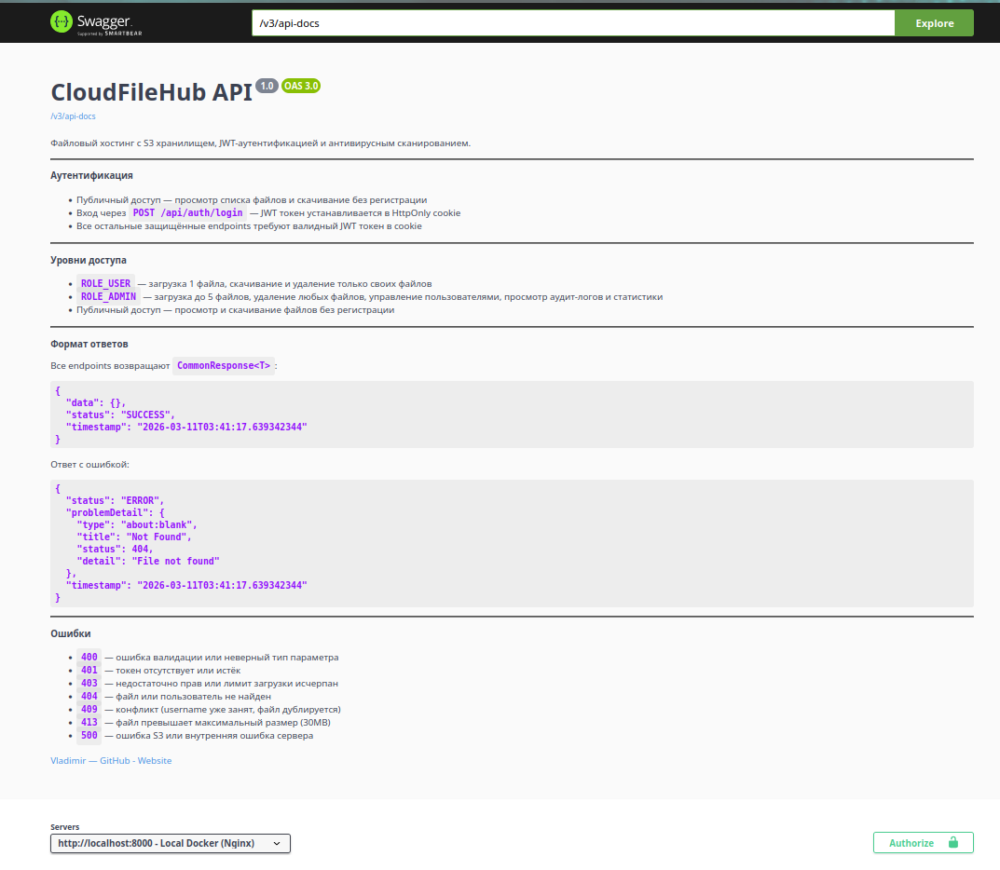
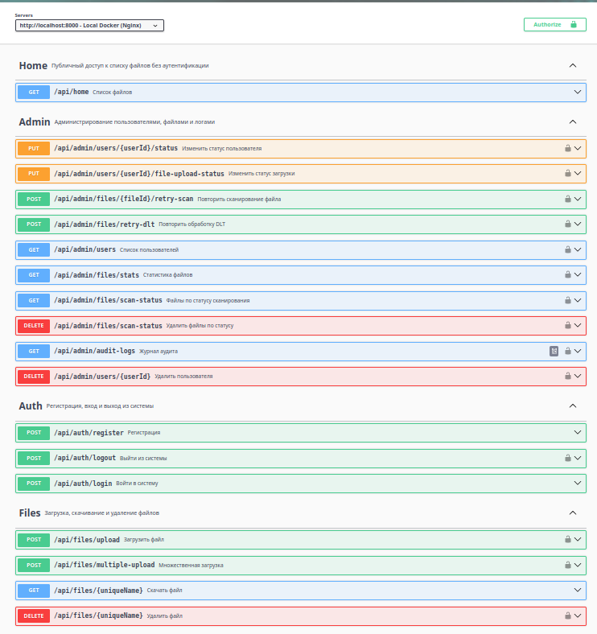
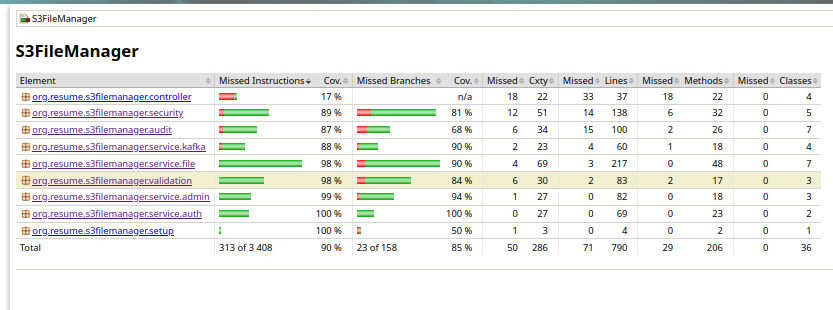

# CloudFileHub
> 🚀 **Live demo:** https://cloudfilehub.duckdns.org/swagger-ui/index.html

Файловый хостинг на S3 с JWT-аутентификацией, ролевой моделью и асинхронным антивирусным сканированием.

## Архитектура и технологии
```
┌─────────────┐     ┌──────────────────┐     ┌──────────────────┐
│    Nginx    │────▶│  s3-file-service │────▶│  Yandex Object   │
│  rate limit │     │  Swagger/OpenAPI │     │  Storage (S3)    │
│    gzip     │     │  PostgreSQL 16   │     └──────────────────┘
└─────────────┘     │  Redis 7 (JWT)   │
                    └────────┬─────────┘
                       Kafka │
                    ┌────────▼─────────┐     ┌──────────────────┐
                    │ antivirus-service│────▶│      ClamAV      │  
                    │ retry + DLT      │     │   (files scan)   │
                    └──────────────────┘     └──────────────────┘
```
## Ключевые особенности

- **Публичный доступ** — просмотр и скачивание файлов без регистрации
- **JWT + Redis** — HttpOnly cookies с whitelist токенов
- **Двухуровневая проверка** — валидация типа/размера (до 30MB) + антивирус через Kafka
- **Ролевая модель:**
    - USER — загрузка 1 файла, удаление только своих файлов
    - ADMIN — загрузка до 5 файлов, удаление любых файлов, управление пользователями, просмотр аудит-логов и статистики
- **Rate limiting** — Nginx (auth: 5r/min, upload: 2r/s, api: 10r/s)

**Доступ:**
- API: https://cloudfilehub.duckdns.org/api/home
- Swagger UI: https://cloudfilehub.duckdns.org/swagger-ui/index.html
- Kafka UI: https://cloudfilehub.duckdns.org/kafka-ui/

## API документация



## Тестирование

Сервисный слой основного модуля `s3-file-service` покрыт unit и интеграционными тестами. JaCoCo собирает объединённый отчёт покрытия.

- **Unit-тесты** — Mockito, запускаются через Maven Surefire
- **Интеграционные тесты** — Testcontainers (PostgreSQL, Redis, Kafka, MinIO), запускаются через Maven Failsafe
```bash
mvn clean verify  # все тесты + отчёт покрытия
```



Отчёт генерируется в `target/site/jacoco-merged/`.

## Быстрый старт
```bash
git clone https://github.com/Vldr22/CloudFileHub.git
cd CloudFileHub
cp .env.example .env                # заполнить переменные окружения
./scripts/docker-build-and-logs.sh  # 1) Собрать, 2) Поднять
```

## Структура проекта
```
CloudFileHub/
├── s3-file-service/      # REST API, авторизация, бизнес-логика
├── antivirus-service/    # Антивирусное сканирование, Kafka retry
├── common-kafka/         # Общие модели событий
├── docker-compose.yml
├── nginx.conf
├── scripts/
└── docs/
```
## Roadmap

- [x] Unit и integration тесты
- [ ] Email-уведомления о результатах сканирования
- [x] Деплой на VPS
- [ ] Полнотекстовый поиск (Elasticsearch)
